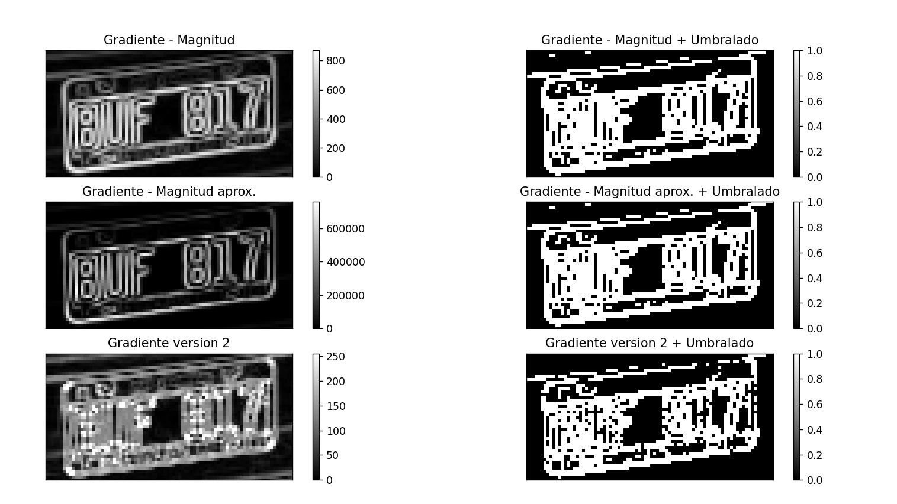

# Computer Vision #

This repository contains two Python scripts designed to process and analyze PNG images for different purposes.

## Files ##

1. **`Ej1.py`**
   - This Python code reads a PNG image showing an embedded circuit and processes it to detect different components and categorize them by size (chip, transistors, resistors, etc.). This is achieved through edge detection algorithms (Canny) and various transformations, including morphological operations. Additionally, objects are identified using connected components algorithms, morphological gradient, opening, closing, filling, dilation, and erosion.

2. **`Ej2.py`**
   - This Python code reads multiple PNG images showing cars from rear and front (Patentes folder) and uses different algorithms and technics to crop the licenses plates.



## **Execution:** ##

To use `pdf2image` (necessary for TP_2) in Visual Studio Code, you need to install **Anaconda**.
Set it as the interpreter in Visual Studio Code.
Then, run the following command:
```bash
conda install -c conda-forge poppler
```

Additionally, to use OCR in Visual Studio Code, follow these steps:

1. First, install the Tesseract installer for Windows. You can find it at the following link: [Tesseract GitHub](https://github.com/UB-Mannheim/tesseract/wiki).


2. Run the following commands in the terminal. Add "py -m -v.v" at first if you have more than one python version installed in your computer.

```bash
pip install Pillow pytesseract
```

Certain libraries need to be imported for functionality, but these are already included in the code.
There is also a ipynb notebook provided where the OCR item is executed, in case you prefer not to install OCR on your computer.